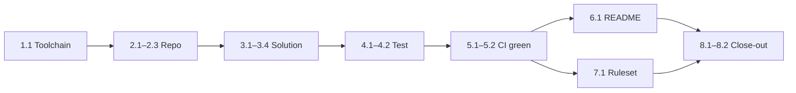

# Militaria Project — Week 1 Specifications

Sep 24, 2026 · @Jeremy

## 1. Purpose and context

Week 1 ends with a public GitHub repository where every push is built and tested automatically, due by Sep 27, 2026. It is the foundation the other 25 weeks build on, so its job is to make every later week cheaper, not to ship features.

Week 1 is the first of the 11 resume-critical weeks that end with the live URL (week 11, week of 30 Nov). It delivers the first half of story **G1** ("every push built and tested automatically"); the deploy half arrives in week 10. Budget: **4 hours**, one sitting preferred. Week 2 starts Sep 28, 2026 with the wireframe review and the EF Core model.

| ID | Objective | Evidence it is met |
| --- | --- | --- |
| O1 | A public repository with professional hygiene | Repo URL opens for a logged-out visitor; license, .gitignore, .editorconfig present |
| O2 | A three-project .NET solution that builds and runs locally | `dotnet build` passes with zero warnings; the web app serves its home page on localhost |
| O3 | One passing unit test | `dotnet test` reports 1 passed, 0 failed |
| O4 | CI on every push and pull request | Green check on the latest `main` commit; README badge shows "passing" |
| O5 | A README a recruiter can read in 60 seconds | Pitch line, nine screen names, stack, roadmap, local run steps |
| O6 | A working system for weeks 2–26 | Branch rules on, milestones and week-2 issues created, next-session note written |

The single success test for the week: a stranger opening the repo on Monday sees a green check, a clear pitch, and a commit dated September 2026.

## 2. Scope

Week 1 covers the repository, the empty-but-real solution, one test, CI, the README, and the project-management scaffolding. Everything that touches data, auth, UI or Azure belongs to a later week and is named below so it is not started early.

### In scope

- Public GitHub repository with license, ignore rules, formatting rules and pinned SDK
- Three-project solution on **.NET 10** (Domain, Web, Domain.Tests) with shared build settings and central package versions
- One meaningful unit test
- GitHub Actions CI workflow (`ci.yml`) running build and tests on every push and pull request
- README v1, ADR folder with a template, and a development log
- Branch protection, Dependabot, milestones, labels and week-2 issues

### Out of scope, and the week each item lands

| Item | Lands in | Why not now |
| --- | --- | --- |
| Wireframe review, EF Core entities, first migration, Postgres in Docker | Week 2 | Needs the wireframe cut first |
| ASP.NET Core Identity, register and log in | Week 3 | Depends on the data model |
| Integration tests with Testcontainers | Week 9 | Nothing to integrate yet |
| Azure resources, Azure for Students activation, $25 budget alert, `cd.yml` | Week 10 | The student credit expires 12 months after sign-up; activating now wastes about two months of it |
| Bicep templates in `infra/` | Week 10 | Written alongside provisioning |
| Written content policy | Before week 11 | Needed before the *site* is public, not the *repo* |
| Playwright end-to-end tests | Week 22 | No user flows exist yet |
| Any UI beyond the Blazor template | Week 7 | Wireframes decide it |

### Assumptions

- A GitHub account with two-factor authentication already exists.
- The development machine can install the .NET 10 SDK and, for week 2, Docker Desktop.
- Public from the first commit is acceptable: git history is permanent, so nothing private ever goes in.
- Week 1 spends **$0**. GitHub-hosted runners are free for public repositories.

### One deliberate deviation from the project plan

The plan names ASP.NET Core 8. **Use .NET 10 instead.** .NET 8 and .NET 9 both reach end of support on 10 November 2026, three weeks before the week-11 live URL. .NET 10 is the current LTS release, supported until 14 November 2028. Launching on a runtime that is already out of support is the first thing a reviewer would flag. It is a one-line change now and a migration later. Record it as ADR-0001 (section 5).

## 3. Deliverables and requirements

Nine deliverables; the five marked Must are the week. Should items are done if the Must set finishes by the 3-hour mark, otherwise they become week-2 issues. Requirement IDs (R-x.y) are referenced by the acceptance checklist in section 8.

| ID | Deliverable | Priority | Serves |
| --- | --- | --- | --- |
| D0 | Local toolchain ready | Must | Every week |
| D1 | Public repository with hygiene files | Must | O1 |
| D2 | Three-project solution scaffold | Must | O2 |
| D3 | First unit test | Must | O3 |
| D4 | CI workflow | Must | O4, story G1 |
| D5 | README v1 | Must | O5 |
| D6 | `docs/` skeleton: ADR template, ADR-0001, dev log | Should | O6 |
| D7 | Repository governance: branch ruleset, Dependabot, merge settings | Should | O6 |
| D8 | Project tracking: milestones, labels, week-2 issues | Should | O6 |

### D0 — Local toolchain

- **R-0.1** .NET 10 SDK installed; `dotnet --version` prints 10.0.x.
- **R-0.2** git 2.40+ and the GitHub CLI (`gh`) installed; `gh auth status` shows logged in.
- **R-0.3** An editor that supports .NET 10: Visual Studio 2026, JetBrains Rider (current), or VS Code with C# Dev Kit. Older Visual Studio 2022 builds cannot target .NET 10.
- **R-0.4** HTTPS developer certificate trusted (`dotnet dev-certs https --trust`).
- **R-0.5** (Should) Docker Desktop installed and running, so week 2 does not open with a large install.

### D1 — Repository

- **R-1.1** Name `militaria-archive`, public, under the personal account, default branch `main`.
- **R-1.2** Description set to a short form of the pitch; topics: `csharp`, `dotnet`, `aspnet-core`, `blazor`, `postgresql`, `pgvector`, `azure`, `semantic-search`, `embeddings`.
- **R-1.3** Root files: `README.md`, `LICENSE` (MIT), `.gitignore` (GitHub's VisualStudio template), `.gitattributes`, `.editorconfig`, `global.json`.
- **R-1.4** `.gitattributes` normalizes line endings to LF, so Windows and the Linux CI runner see identical files.
- **R-1.5** Commits use the GitHub no-reply address (`<id>+<username>@users.noreply.github.com`), so the public history never exposes a personal email and every commit still counts on the contribution graph.
- **R-1.6** Secret scanning and push protection are on (default for public repositories; verify in Settings → Code security).

### D2 — Solution scaffold

- **R-2.1** Exactly three projects, matching the plan's "start with three" rule and the target layout's names so nothing is renamed later:

  | Project | Path | Template | References |
  | --- | --- | --- | --- |
  | Militaria.Domain | `src/Militaria.Domain` | `classlib` | none |
  | Militaria.Web | `src/Militaria.Web` | `blazor`, Server interactivity, no auth | Domain |
  | Militaria.Domain.Tests | `tests/Militaria.Domain.Tests` | `xunit3` | Domain |
- **R-2.2** `Militaria.Domain` has zero NuGet packages and zero project references. This is the rule that keeps it testable forever.
- **R-2.3** `Militaria.Web` hosts both the Blazor UI and the API endpoints until week 6+ gives a concrete reason to split out `Militaria.Api`.
- **R-2.4** Server interactivity, not Auto or WebAssembly: Auto adds a fourth `.Client` project, which breaks the three-project rule for no week-1 benefit.
- **R-2.5** Authentication set to None. Identity is wired by hand in week 3, as the plan intends.
- **R-2.6** Shared settings live once in `Directory.Build.props` (target framework, nullable, implicit usings, warnings-as-errors in CI). Project files carry no duplicate settings.
- **R-2.7** Package versions live once in `Directory.Packages.props` (central package management). No `Version=` attribute appears in any `.csproj`.
- **R-2.8** `Militaria.Web` exposes `GET /health` returning 200 with body `Healthy`. App Service uses it in week 10 and the smoke test uses it in week 11.
- **R-2.9** `dotnet build` on a clean clone completes with 0 warnings and 0 errors.
- **R-2.10** `dotnet run --project src/Militaria.Web` serves the template home page and `/health` on localhost.

### D3 — First unit test

- **R-3.1** The test asserts a real product rule, not `Assert.True(true)`. Use the pitch's "private-by-default" rule: add `ItemVisibility { Private, Unlisted, Public }` to `Militaria.Domain` and test that `default(ItemVisibility)` is `Private`.
- **R-3.2** Naming: `Subject_Condition_ExpectedResult` (e.g. `ItemVisibility_Default_IsPrivate`); body in Arrange / Act / Assert order.
- **R-3.3** Use xUnit's built-in `Assert` for now. The assertion-library choice is deferred to week 4 (see section 10): FluentAssertions 8 moved to a paid commercial license in January 2025.
- **R-3.4** `dotnet test` reports 1 passed, 0 failed, in under 5 seconds locally.

### D4 — CI workflow

- **R-4.1** File `.github/workflows/ci.yml`, workflow name `CI`, one job with the id and display name `build-test`. The name is permanent: the branch ruleset requires it by name.
- **R-4.2** Triggers: push to any branch, pull request targeting `main`, and manual `workflow_dispatch`.
- **R-4.3** Runs on `ubuntu-latest`, matching the Linux App Service target, so case-sensitive path bugs show up now rather than at deploy.
- **R-4.4** SDK installed from `global.json`, so CI and local builds use the same SDK.
- **R-4.5** Steps: checkout → setup .NET → restore → build (Release, no restore) → test (Release, no build, TRX logger) → upload test results as an artifact even on failure.
- **R-4.6** Least privilege: `permissions: contents: read`.
- **R-4.7** `concurrency` cancels a superseded run on the same branch; job `timeout-minutes: 15`.
- **R-4.8** Fails the run on any compiler warning (via `CI=true`, which GitHub sets automatically) or any failing test.
- **R-4.9** Completes in under 5 minutes.
- **R-4.10** Proven to gate: one deliberately failing test pushed on a throwaway branch produces a red run, then the branch is deleted.

### D5 — README v1

- **R-5.1** Sections, in order: title and CI badge; one-line pitch; status ("Week 1 of 26 — foundation"); what it will do (3–4 sentences); the nine planned screens; tech stack; roadmap with the four milestones; run locally; repository layout; design decisions (links to ADRs); license.
- **R-5.2** The badge points at `ci.yml` on `main` and renders "passing".
- **R-5.3** Every command in "Run locally" works on a fresh clone, verified by re-cloning to a temporary folder.
- **R-5.4** Readable in 60 seconds: under about 400 words, no screenshots or live link yet (those arrive in week 11).
- **R-5.5** Honest status: planned features are labelled planned. Nothing reads as built before it is.

### D6 — docs/ skeleton (Should)

- **R-6.1** `docs/adr/0000-template.md`: Title, Status, Date, Context, Decision, Alternatives considered, Consequences.
- **R-6.2** `docs/adr/0001-target-dotnet-10-lts.md`, status Accepted.
- **R-6.3** `docs/dev-log.md` with a "Next sitting" block at the top and the week-1 entry below it.
- **R-6.4** (Could) `.github/pull_request_template.md` with What / Why / How tested.

### D7 — Repository governance (Should)

- **R-7.1** Ruleset on `main`: require a pull request (0 approvals), require status check `build-test`, block force pushes, block deletion. Turned on only after the first green run, because GitHub lists a check only once it has run.
- **R-7.2** Merge settings: squash merge only; delete head branches automatically.
- **R-7.3** `.github/dependabot.yml`: `nuget` and `github-actions` ecosystems, weekly, updates grouped per ecosystem, at most 5 open PRs.

### D8 — Project tracking (Should)

- **R-8.1** Four GitHub milestones with due dates: M1 Security story complete (25 Oct 2026), M2 Live URL (6 Dec 2026), M3 AI discovery evaluated (7 Feb 2027), M4 Portfolio-grade (18 Apr 2027).
- **R-8.2** Labels: `must`, `should`, `could`; `feature`, `chore`, `docs`, `test`, `ci`; `phase-0` to `phase-6`.
- **R-8.3** One issue per week-2 task, titled with its story ID where one exists (e.g. "B1: EF Core entities for the data model"), assigned to M1.
- **R-8.4** Stories are added to issues a phase at a time, not all 26 now: the backlog stays short enough to read.

## 4. Technical foundation and hosting

Week 1 hosts code on GitHub and runs CI on GitHub-hosted Linux runners; the application itself is not hosted anywhere until week 10. Every choice below is made so that week 10 is configuration, not rework.

### Environments

| Environment | Where | Status in week 1 | Purpose | Configuration source |
| --- | --- | --- | --- | --- |
| Local | Your machine | Active | Write, run, debug | `appsettings.Development.json`; user-secrets from week 3 |
| CI | GitHub Actions, `ubuntu-latest` | Active | Gate every push and PR | Workflow file; no secrets needed |
| Production | Azure App Service (Linux) + Postgres Flexible Server + Blob + Key Vault | Not provisioned until week 10 | Public live URL | App settings and Key Vault references via Managed Identity |

No staging environment. At four hours a week one production target is proportionate, and deployment slots need the Standard App Service tier, which costs more than the Basic tier the plan budgets.

### Hosting timeline

- **Code:** GitHub, public, from week 1.
- **CI:** GitHub Actions, from week 1. Standard runners are free and unmetered for public repositories.
- **Application:** Azure App Service (Linux), from week 10, at the default `*.azurewebsites.net` address. A custom domain (about $12 a year) is a Could for weeks 23–26.
- **Azure for Students:** $100 credit, valid 12 months from sign-up, no credit card, renewable yearly while a student. Activate it in week 10, not now: activating in late November keeps the credit alive through November 2027, covering the whole interview season. Set the $25 budget alert the same day, before creating any resource.

### Repository layout at the end of week 1

```text
militaria-archive/
├── .github/
│   ├── workflows/ci.yml
│   ├── dependabot.yml
│   └── pull_request_template.md
├── docs/
│   ├── adr/0000-template.md
│   ├── adr/0001-target-dotnet-10-lts.md
│   └── dev-log.md
├── src/
│   ├── Militaria.Domain/
│   └── Militaria.Web/
├── tests/
│   └── Militaria.Domain.Tests/
├── .editorconfig
├── .gitattributes
├── .gitignore
├── Directory.Build.props
├── Directory.Packages.props
├── global.json
├── LICENSE
├── Militaria.slnx
└── README.md
```

The .NET 10 SDK creates the newer XML `.slnx` solution format by default; the plan's `Militaria.sln` is the older format. Keep whichever `dotnet new sln` produces. Later additions slot in without moving anything: `docs/wireframes/` (week 2), `tests/Militaria.Integration.Tests/` (week 9), `infra/` and `cd.yml` (week 10), `src/Militaria.Functions/` (week 13).

### Reference configuration

These are the target contents. Type them rather than paste them (section 7 explains why).

**`global.json`** — pins the SDK for you and for CI. Use the exact version `dotnet --version` prints.

```json
{
  "sdk": {
    "version": "10.0.100",
    "rollForward": "latestFeature"
  }
}
```

**`Directory.Build.props`** — applies to every project. Delete the matching lines from each `.csproj` after adding it.

```xml
<Project>
  <PropertyGroup>
    <TargetFramework>net10.0</TargetFramework>
    <Nullable>enable</Nullable>
    <ImplicitUsings>enable</ImplicitUsings>
    <!-- Strict in CI, forgiving locally. GitHub Actions sets CI=true. -->
    <TreatWarningsAsErrors Condition="'$(CI)' == 'true'">true</TreatWarningsAsErrors>
  </PropertyGroup>
</Project>
```

**`Directory.Packages.props`** — one place for every package version. Copy the versions out of the test project's `.csproj`, then remove the `Version=` attributes there, or restore fails with NU1008.

```xml
<Project>
  <PropertyGroup>
    <ManagePackageVersionsCentrally>true</ManagePackageVersionsCentrally>
  </PropertyGroup>
  <ItemGroup>
    <PackageVersion Include="Microsoft.NET.Test.Sdk" Version="(from template)" />
    <PackageVersion Include="xunit.v3" Version="(from template)" />
    <PackageVersion Include="xunit.runner.visualstudio" Version="(from template)" />
  </ItemGroup>
</Project>
```

**`.gitattributes`**

```text
* text=auto eol=lf
*.cmd text eol=crlf
*.bat text eol=crlf
*.png binary
*.jpg binary
*.jpeg binary
*.webp binary
```

**Health endpoint** — two lines in `src/Militaria.Web/Program.cs`; health checks ship in the ASP.NET Core framework, so no package is added.

```csharp
builder.Services.AddHealthChecks();   // with the other service registrations
app.MapHealthChecks("/health");       // after app is built
```

**`.github/workflows/ci.yml`**

```yaml
name: CI

on:
  push:
  pull_request:
    branches: [main]
  workflow_dispatch:

permissions:
  contents: read

concurrency:
  group: ci-${{ github.ref }}
  cancel-in-progress: true

jobs:
  build-test:
    name: build-test
    runs-on: ubuntu-latest
    timeout-minutes: 15
    steps:
      - uses: actions/checkout@v5
      - uses: actions/setup-dotnet@v5
        with:
          global-json-file: global.json
      - name: Restore
        run: dotnet restore
      - name: Build
        run: dotnet build --configuration Release --no-restore
      - name: Test
        run: dotnet test --configuration Release --no-build --logger trx --results-directory TestResults
      - name: Upload test results
        if: always()
        uses: actions/upload-artifact@v4
        with:
          name: test-results
          path: TestResults
```

Check each action's Marketplace page for its current major version when you type this; Dependabot keeps them current afterwards. A push to a branch with an open PR runs the workflow twice (once for the push, once for the PR). That is free on a public repository and not worth optimizing.

**`.github/dependabot.yml`**

```yaml
version: 2
updates:
  - package-ecosystem: nuget
    directory: /
    schedule:
      interval: weekly
    open-pull-requests-limit: 5
    groups:
      nuget:
        patterns: ["*"]
  - package-ecosystem: github-actions
    directory: /
    schedule:
      interval: weekly
    groups:
      actions:
        patterns: ["*"]
```

## 5. Documentation standards

All project documentation lives in the repository as Markdown, versioned with the code; diagrams are Mermaid, which GitHub renders natively. These standards start in week 1 and apply for all 26 weeks.

| Artifact | Location | Audience | Format and rule | Updated |
| --- | --- | --- | --- | --- |
| README | `/README.md` | Recruiters, interviewers | Structure in R-5.1; status line always true | Each milestone, and whenever a command changes |
| Architecture decision records | `docs/adr/NNNN-kebab-title.md` | Interviewers, future you | Template below; never edited once Accepted, only superseded by a new ADR | When a decision is made |
| Development log | `docs/dev-log.md` | Future you | "Next sitting" block at top, then entries newest first | End of every sitting |
| Commit messages | git history | Reviewers | Conventional Commits, imperative subject ≤ 72 chars | Every commit |
| Pull requests | GitHub | Reviewers | What / Why / How tested; links its issue with `Closes #n` | Every PR, from week 2 |
| Issues | GitHub | You, as project manager | Story ID in the title; label, milestone | When planned |
| Code comments | Source | Maintainers | Explain *why*, never *what*; XML doc comments only on public Domain types | With the code |
| Diagrams | `docs/*.md` | Interviewers | Mermaid in Markdown, not image files | Weeks 23–26 (architecture), sooner if useful |

### ADR template (`docs/adr/0000-template.md`)

```markdown
# NNNN. Title in the imperative ("Use PostgreSQL with pgvector")

- Status: Proposed | Accepted | Superseded by NNNN
- Date: YYYY-MM-DD

## Context
What forces are at play: the problem, constraints, and what is known.

## Decision
The choice, in one or two sentences.

## Alternatives considered
Each option and why it lost.

## Consequences
What gets easier, what gets harder, what must be revisited and when.
```

### ADR register

The plan's five ADRs plus the one this week creates. Write each on the day the call is made; 20 minutes each.

| # | Decision | Written in |
| --- | --- | --- |
| 0001 | Target .NET 10 LTS rather than .NET 8 | Week 1 |
| 0002 | PostgreSQL over MySQL | Week 2 |
| 0003 | ASP.NET Core Identity with TOTP over Entra External ID | Week 3 |
| 0004 | Blazor over React | Week 7 (first real UI) |
| 0005 | pgvector over a dedicated vector database | Week 12 |
| 0006 | Asynchronous embeddings over inline generation | Week 13 |

ADR-0001's substance: .NET 8 and 9 leave support on 10 Nov 2026, before the week-11 launch; .NET 10 is LTS until 14 Nov 2028; the plan's stack is otherwise unchanged; the cost is one property value.

### Commit message convention

Prefix with a type: `feat`, `fix`, `test`, `docs`, `ci`, `chore`, `refactor`. Example week-1 history, one commit per green state:

```text
chore: add license, gitignore, gitattributes, editorconfig
chore: pin .NET 10 SDK with global.json
feat: scaffold Domain, Web and Domain.Tests projects
chore: centralize build settings and package versions
feat: add /health endpoint
test: default item visibility is private
ci: build and test on every push and pull request
docs: write README v1
docs: add ADR template and ADR-0001
ci: add Dependabot for NuGet and GitHub Actions
```

### Development log entry (`docs/dev-log.md`)

```markdown
## Next sitting
Week 2: open docs/wireframes, cut non-Must elements, then issue #N (EF Core entities).

## 2026-09-2X — Week 1 (planned 4h, actual Xh)
- Done: ...
- Slipped to next week: ...
- Blocked by / surprised by: ...
- Estimate vs actual: which block ran long and why
```

## 6. Work breakdown and schedule

The week is 23 tasks totalling 225 minutes, plus a 5-minute break and a 10-minute buffer. The Must path alone is 170 minutes, which leaves 70 minutes of slack for first-time CI debugging before anything Must is at risk.

### Work breakdown structure

| ID | Task | Deliverable | Est. (min) | Depends on | Priority |
| --- | --- | --- | --- | --- | --- |
| 1.1 | Install and verify SDK, git, `gh`, editor, dev cert | D0 | 15 | — | Must |
| 1.2 | Start Docker Desktop install in the background | D0 | 0 (parallel) | — | Should |
| 2.1 | Create public repo with MIT license and .NET gitignore; clone | D1 | 5 | 1.1 | Must |
| 2.2 | Set git identity to the no-reply email | D1 | 5 | 2.1 | Must |
| 2.3 | Add `.gitattributes`, `.editorconfig`, `global.json`; commit | D1 | 10 | 2.2 | Must |
| 2.4 | Set description and topics; confirm secret scanning | D1 | 5 | 2.1 | Should |
| 3.1 | Create solution, three projects, references | D2 | 15 | 2.3 | Must |
| 3.2 | Add `Directory.Build.props` and `Directory.Packages.props`; strip duplicates from `.csproj` files | D2 | 10 | 3.1 | Must |
| 3.3 | Add `/health`; run the app; check both URLs | D2 | 10 | 3.2 | Must |
| 3.4 | Clean build with 0 warnings; commit | D2 | 5 | 3.3 | Must |
| 4.1 | Add `ItemVisibility` and its test | D3 | 15 | 3.4 | Must |
| 4.2 | `dotnet test` green; commit | D3 | 5 | 4.1 | Must |
| 5.1 | Write `ci.yml` | D4 | 20 | 4.2 | Must |
| 5.2 | Push; watch the run; fix until green | D4 | 15 | 5.1 | Must |
| 5.3 | Prove the gate: failing test on a throwaway branch goes red; delete branch | D4 | 10 | 5.2 | Should |
| 6.1 | Write README v1 with badge; verify on a fresh clone | D5 | 25 | 5.2 | Must |
| 6.2 | ADR template, ADR-0001, dev log | D6 | 15 | 2.1 | Should |
| 6.3 | Pull request template | D6 | 5 | 2.1 | Could |
| 7.1 | Branch ruleset and merge settings | D7 | 5 | 5.2 | Should |
| 7.2 | `dependabot.yml` | D7 | 5 | 3.2 | Should |
| 7.3 | Labels, four milestones, week-2 issues | D8 | 10 | 2.1 | Should |
| 8.1 | Walk the section 8 checklist | — | 10 | all | Must |
| 8.2 | Dev log entry, "Next sitting" note, estimate vs actual | D6 | 5 | 8.1 | Must |

### Critical path



Everything to the left of "CI green" is strictly sequential. The docs and tracking tasks (6.2, 6.3, 7.2, 7.3) hang off the repo and can fill any wait, for example while a CI run is in progress.

### Session plan: one 4-hour sitting

| Clock | Block | Tasks | Exit check before moving on |
| --- | --- | --- | --- |
| 0:00–0:15 | A. Prepare | 1.1, start 1.2 | `dotnet --version` prints 10.0.x |
| 0:15–0:40 | B. Repository | 2.1–2.4 | Repo visible logged out; first commits pushed |
| 0:40–1:20 | C. Solution | 3.1–3.4 | 0-warning build; `/health` returns Healthy |
| 1:20–1:40 | D. Test | 4.1–4.2 | 1 passed, 0 failed |
| 1:40–1:45 | Break | — | Stand up, away from the screen |
| 1:45–2:30 | E. CI | 5.1–5.3 | Green check on `main`; red run seen on throwaway branch |
| 2:30–2:55 | F. README | 6.1 | Badge passing; fresh-clone run works |
| 2:55 | **Checkpoint** | — | All Must items done? If not, stop adding scope and finish them |
| 2:55–3:35 | G. Docs and governance | 6.2, 6.3, 7.1–7.3 | Ruleset active; milestones exist |
| 3:35–3:50 | H. Close-out | 8.1–8.2 | Checklist complete; next-sitting note written |
| 3:50–4:00 | Buffer | — | Stop at 4:00 even if unused |

### Split option: two sittings

If four consecutive hours are not available, split after block E. **Sitting 1 (2h 30m):** blocks A–E, ending on a green check, which is the plan's own rule for the first sitting. **Sitting 2 (1h 30m):** blocks F–H. Do not split anywhere before the green check; a half-configured pipeline is the hardest thing to pick back up.

## 7. How to approach the work

Work in time-boxed blocks, commit at every green state, and never end a sitting with `main` red. The rules below cover how to run the sitting, what to type, and what to do when stuck or facing a choice this spec does not settle.

### Working principles

1. **Green first, pretty second.** Get the pipeline passing on the plainest possible code, then improve. Week 1 is judged by the green check, not by the README prose.
2. **Time-box every block.** Set a timer per block in section 6. When it rings, check the exit condition: met → move on; not met → use the stuck protocol below.
3. **Small commits at every green state.** Roughly every 15–20 minutes. A commit is a save point you can return to; ten small ones beat one large one.
4. **Type it, don't paste it.** That includes the configuration in this spec. Typing forces you to read every line, and every line is something an interviewer may ask about. Use AI assistants to explain an error or a concept, not to generate files.
5. **Stop at four hours.** The plan's rule: if a week runs short, push the leftover work, never compress two weeks into one.

### Before the sitting (10 minutes, the day before)

- Read sections 6 and 8 of this spec.
- Put the sitting in your calendar as a fixed appointment.
- Have the GitHub no-reply address ready (GitHub → Settings → Emails).

### Command sequence for blocks B and C

```bash
# Block B — repository
gh repo create militaria-archive --public --license mit --gitignore VisualStudio \
  --description "Private-by-default archive for military memorabilia with embedding-based search" --clone
cd militaria-archive
git config user.email "<id>+<username>@users.noreply.github.com"
dotnet new globaljson --sdk-version <version from dotnet --version> --roll-forward latestFeature
dotnet new editorconfig
# write .gitattributes by hand (section 4), then:
git add . && git commit -m "chore: add gitattributes, editorconfig, global.json" && git push

# Block C — solution
dotnet new sln -n Militaria
dotnet new classlib -n Militaria.Domain -o src/Militaria.Domain
dotnet new blazor -n Militaria.Web -o src/Militaria.Web --interactivity Server --auth None
dotnet new install xunit.v3.templates
dotnet new xunit3 -n Militaria.Domain.Tests -o tests/Militaria.Domain.Tests
dotnet sln add src/Militaria.Domain src/Militaria.Web tests/Militaria.Domain.Tests
dotnet add src/Militaria.Web reference src/Militaria.Domain
dotnet add tests/Militaria.Domain.Tests reference src/Militaria.Domain
dotnet new buildprops      # then edit to match section 4
dotnet new packagesprops   # then move versions out of the test .csproj
dotnet build
```

Delete the template's `Class1.cs` and `UnitTest1.cs` before the first build commit.

### Code for block D

```csharp
// src/Militaria.Domain/ItemVisibility.cs
namespace Militaria.Domain;

// Explicit values: these integers are stored in the database from week 2,
// so reordering the names must never change what a stored row means.
public enum ItemVisibility
{
    Private = 0,
    Unlisted = 1,
    Public = 2,
}
```

```csharp
// tests/Militaria.Domain.Tests/ItemVisibilityTests.cs
namespace Militaria.Domain.Tests;

public class ItemVisibilityTests
{
    [Fact]
    public void ItemVisibility_Default_IsPrivate()
    {
        var visibility = default(ItemVisibility);

        Assert.Equal(ItemVisibility.Private, visibility);
    }
}
```

### Git workflow

Week 1 commits straight to `main`: there is no CI to protect it until block E. Once the ruleset is on (task 7.1), every change from week 2 onwards follows one loop:

1. Move the issue to "In progress".
2. `git switch -c wk02/b1-ef-core-entities` (week number, story ID, short description).
3. Commit at each green state, using the Conventional Commits types in section 5.
4. `gh pr create --fill`, with `Closes #n` in the body.
5. Squash-merge when `build-test` is green; the branch deletes itself.
6. `git switch main && git pull`.

Pull requests on a solo project are not ceremony. They are what forces CI to pass before `main` moves, and the PR list shows a reviewer how you work.

### Stuck protocol

- **At 15 minutes stuck** on one problem: write the exact error in the dev log, then search it or ask an assistant to explain it.
- **At 30 minutes:** take the documented fallback in section 9 if one exists, or park the task as an issue and move to the next block.
- **Never** let one stuck task eat the Must path. The checkpoint at 2:55 exists for this.

### Decisions this spec does not settle

If a choice takes more than 5 minutes to make, take the template default, write one line in the dev log saying what you picked, and move on. Write an ADR only if an interviewer could plausibly ask "why did you choose that?"

### Track estimate against actual

Note the real finishing time of each block in the dev log. After three or four weeks you will know your own speed, and later estimates (weeks 4–5 are the tightest) become evidence instead of hope.

## 8. Definition of done and acceptance criteria

Week 1 is done when every Must box below is ticked and each Should item is either ticked or recorded as a week-2 issue. The project-wide definition of done is also set this week and applies to every task through week 26.

### Project-wide definition of done (every task, every week)

A task is done only when all of these hold:

1. It builds in CI with 0 warnings and all tests pass.
2. New logic has tests where the plan says tests matter: authentication, authorization, ranking, and any rule a bug would silently break. Getters and markup are exempt; there is no coverage percentage target.
3. It reached `main` through a pull request with a green `build-test` check (from week 2).
4. No secrets, connection strings or personal data are in the diff.
5. README, ADRs or run instructions are updated if the change affects them.
6. Its issue is closed by the PR, and the dev log mentions it.

### Week 1 acceptance checklist — Must

- [ ] **AC-1** (R-0.1, R-0.2) `dotnet --version` prints 10.0.x and `gh auth status` shows logged in.
- [ ] **AC-2** (R-1.1) The repo URL opens in a private browser window while logged out.
- [ ] **AC-3** (R-1.3, R-1.4) `LICENSE`, `.gitignore`, `.gitattributes`, `.editorconfig`, `global.json` are on `main`.
- [ ] **AC-4** (R-1.5) Every commit on `main` shows your avatar on GitHub; no personal email appears in `git log --format=%ae`.
- [ ] **AC-5** (R-2.1, R-2.2) The solution contains exactly three projects; `Militaria.Domain.csproj` has no `PackageReference` or `ProjectReference`.
- [ ] **AC-6** (R-2.6, R-2.7) No `.csproj` contains `TargetFramework`, `Nullable` or a `Version=` attribute.
- [ ] **AC-7** (R-2.9) `dotnet build -c Release` on a fresh clone: 0 warnings, 0 errors.
- [ ] **AC-8** (R-2.8, R-2.10) With the app running, the home page loads and `/health` returns 200 `Healthy`.
- [ ] **AC-9** (R-3.1–R-3.4) `dotnet test` reports 1 passed, 0 failed; the test is `ItemVisibility_Default_IsPrivate`.
- [ ] **AC-10** (R-4.1–R-4.9) The latest `main` commit shows a green `build-test` check that finished in under 5 minutes, with a `test-results` artifact attached.
- [ ] **AC-11** (R-5.1–R-5.5) The README shows a passing badge, the pitch, the nine screens and the four milestones; its "Run locally" commands work on a fresh clone.
- [ ] **AC-12** Dev log has the week-1 entry and a "Next sitting" note naming the first week-2 task.

### Week 1 acceptance checklist — Should and Could

- [ ] **AC-13** (R-0.5) `docker run hello-world` succeeds.
- [ ] **AC-14** (R-1.2, R-1.6) Description and topics show on the repo page; push protection is on.
- [ ] **AC-15** (R-4.10) A red run exists on a deleted throwaway branch, proving a failing test fails CI.
- [ ] **AC-16** (R-6.1, R-6.2) `docs/adr/0000-template.md` and `0001-target-dotnet-10-lts.md` exist; 0001 is Accepted.
- [ ] **AC-17** (R-7.1, R-7.2) A direct push to `main` is rejected; merge options show squash only.
- [ ] **AC-18** (R-7.3) Dependabot appears under Insights → Dependency graph → Dependabot with two ecosystems.
- [ ] **AC-19** (R-8.1–R-8.3) Four milestones with due dates exist, and each week-2 task has an issue in M1.
- [ ] **AC-20** (R-6.4, Could) Opening a new PR pre-fills the template.

### How to verify the fresh-clone items (AC-7, AC-11)

```bash
cd "$(mktemp -d)"
git clone https://github.com/<username>/militaria-archive.git
cd militaria-archive
dotnet build -c Release && dotnet test -c Release
```

If this works in an empty temporary folder, it works for a recruiter, for CI, and for you after the winter break.

## 9. Risks, dependencies and fallbacks

The likeliest week-1 failure is CI passing locally but failing on the Linux runner; the most damaging is a secret committed to a public repository. Each risk below has a trigger to watch for and a fallback that keeps the Must path moving.

### Risk register

| ID | Risk | Likelihood | Impact | Trigger | Mitigation and fallback |
| --- | --- | --- | --- | --- | --- |
| R1 | CI fails on Linux but passes locally (path casing, line endings, SDK mismatch) | Medium | High | Red run with an error you cannot reproduce | `.gitattributes` and `global.json` prevent most of it. Match folder and file casing exactly. Fallback: replace `global-json-file` with `dotnet-version: '10.0.x'` in `ci.yml` and log it |
| R2 | Restore fails with NU1008 after enabling central package management | Medium | Low | `dotnet restore` error naming NU1008 | Remove every `Version=` from `.csproj` files; versions live only in `Directory.Packages.props` |
| R3 | Template code produces warnings, which CI turns into errors | Low | Medium | Red build on a warning ID | Fix it. If it is template noise, suppress that one ID in `.editorconfig` with a comment saying why |
| R4 | Editor cannot open a .NET 10 solution | Medium | Medium | Load errors in an older Visual Studio | Use the CLI plus VS Code with C# Dev Kit for the week; upgrade the IDE later |
| R5 | A secret or personal detail is committed to the public repo | Low | High | Push protection blocks a push, or you notice it in a diff | Nothing secret exists in week 1. If it happens: revoke or rotate the secret first, then clean history. Rotating is what protects you; deleting the commit does not |
| R6 | Tool installs overrun block A | Medium | Medium | Block A past 0:30 | Start installs the day before. Fallback: drop Should items at the 2:55 checkpoint, not Must items |
| R7 | Scope creep into week 2 (entities, EF Core, UI) | Medium | Medium | Opening a file not named in this spec | Section 2's out-of-scope list; write the idea down as an issue instead |
| R8 | Coursework or exams take the week's sitting | Medium | Medium | No sitting booked by Friday | Use the two-sitting split; the Must path alone is under 3 hours. If the whole week is lost, push the row, per the plan |
| R9 | HTTPS dev certificate not trusted | Low | Low | Browser certificate warning on localhost | `dotnet dev-certs https --clean` then `--trust`; or run the `http` launch profile for the week |
| R10 | Branch ruleset cannot find the `build-test` check | Low | Low | Check missing from the ruleset picker | It must have run at least once; turn the ruleset on after the first green run |

### Dependencies

| Dependency | Needed for | Status to confirm before the sitting |
| --- | --- | --- |
| GitHub account with 2FA | D1, D4 | Signed in; `gh auth login` done |
| .NET 10 SDK | D2–D4 | Installed |
| A .NET 10-capable editor | D2, D3 | Installed |
| Network access to GitHub and NuGet | All | Campus or home network, not a captive portal |
| Docker Desktop | Week 2 (not week 1) | Install started |
| Wireframe set that accompanies the plan | Week 2 | Located; saved into `docs/wireframes/` at the start of week 2 |

No other person, paid service, or Azure resource is needed this week.

## 10. Setting up week 2 and beyond

Most of week 1's value is in decisions that make later weeks cheaper. The table below shows which later week each one protects, so none of them gets "simplified away" under time pressure.

### Decisions made now, and what they protect

| Week 1 decision | Protects | How |
| --- | --- | --- |
| .NET 10 LTS | Weeks 10–26 and the interview season | Runtime supported until Nov 2028; no forced migration mid-project |
| Linux CI runner | Week 10 deploy to Linux App Service | Casing and line-ending bugs surface in week 1, not at launch |
| Stable job name `build-test` | Week 9 onward | Adding integration tests never silently removes the required check |
| Central package management | Weeks 2, 3, 8, 13 (EF Core, Npgsql, Identity, Blob, OpenAI packages) | One file of versions; Dependabot PRs touch one file |
| Target-layout project names | Week 9 test split, later Api split | No renames or broken references later |
| `/health` endpoint | Weeks 10–11 | App Service health check and the launch smoke test are ready |
| Explicit enum values | Week 2 migrations onward | Stored integers keep their meaning if names are reordered |
| Deferred Azure activation | Weeks 10–26 and after | Student credit lasts until about Nov 2027 instead of Sep 2027 |
| No-reply commit email | Permanent public history | Personal email never exposed |
| Dev log with "Next sitting" | Winter gap, 7 Dec – 11 Jan | The plan's own mitigation becomes a weekly habit, not a one-off |

### Open decisions and when to settle them

| Decision | Options | Settle by | Recommendation |
| --- | --- | --- | --- |
| Assertion library | FluentAssertions 7.x (Apache 2.0, frozen); FluentAssertions 8 (free non-commercial, $129.95 per developer per year commercial); Shouldly (open source); AwesomeAssertions (open-source community fork of FluentAssertions) | Week 4, before the week-5 auth tests | Shouldly or FluentAssertions 7.x; record it as a short ADR either way |
| PostgreSQL major version | Whichever versions Azure Flexible Server offers in week 10 | Week 2 | Run the `pgvector/pgvector` Docker image at that same major version from week 2, so week 12's `CREATE EXTENSION vector` is already proven locally |
| When to split out `Militaria.Api` | Keep combined, or split | When it hurts | Split only when a concrete need appears, e.g. a second client or conflicting auth schemes. Log the trigger in an ADR |

### Week 2 preview (week of 28 Sep)

Wireframe review and cut, EF Core entities for the eight-table model, first migration, Postgres running locally in Docker. Prerequisites week 1 should leave in place: Docker Desktop working, wireframes located, week-2 issues on the board, and the "Next sitting" note naming the first task.

### End-of-week review (inside close-out, task 8.2)

Answer three questions in the dev log, one or two lines each:

1. Which block ran longest against its estimate, and why?
2. What will you do differently in week 2's sitting?
3. Is anything in the plan now wrong? If so, open an issue rather than silently diverging.

## Sources

- [.NET and .NET Core support policy](https://dotnet.microsoft.com/en-us/platform/support/policy/dotnet-core): .NET 10 LTS to 14 Nov 2028; .NET 8 and 9 end 10 Nov 2026
- [.NET 8 and .NET 9 will reach End of Support on November 10, 2026](https://devblogs.microsoft.com/dotnet/dotnet-8-9-end-of-support/), .NET Blog
- [Azure for Students](https://azure.microsoft.com/en-us/free/students): $100 credit, 12 months, no card, renewable
- [Fluent Assertions Library v8 Abandons Apache Licensing](https://www.infoq.com/news/2025/01/fluent-assertions-v8-license/), InfoQ
- Militaria Archive — Project Plan, 15 Sep 2026 (the source of all week numbers, stories and stack choices)
